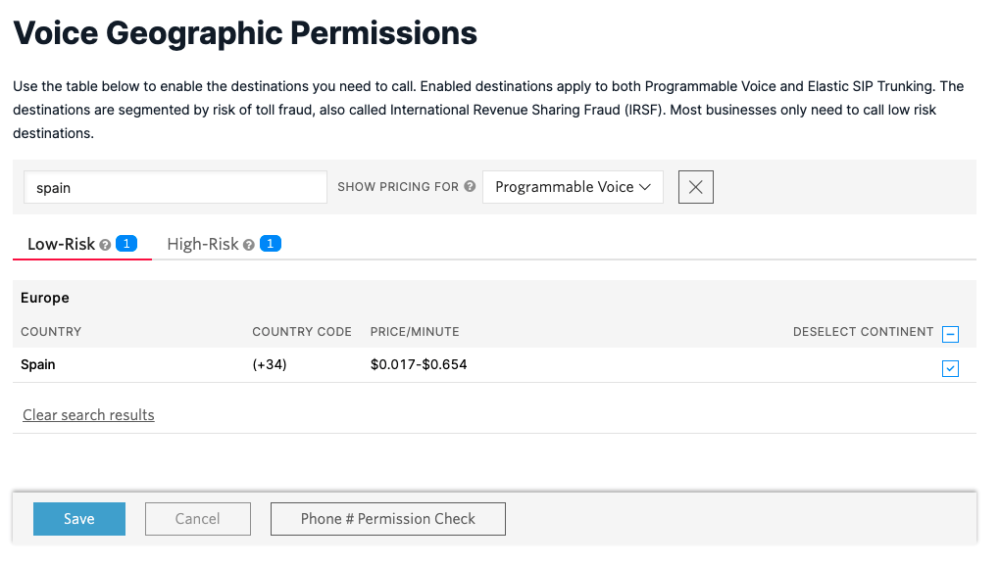

# Simple Spark API Playground implementation using Twilio API

This is a implementation of Simple Spark API Playground using Twilio to send SMS and make voice calls

## Resources
* Simple Spark API Playground as base project: https://github.com/benjagra/simple-spark-api-playground
* How to send a SMS in Java: https://www.twilio.com/docs/sms/quickstart/java
* How to make a voice call in Java: https://www.twilio.com/docs/voice/quickstart/java

## Dependencies added
We added below dependencies to the base project:
```
    <dependency>
      <groupId>io.github.cdimascio</groupId>
      <artifactId>java-dotenv</artifactId>
      <version>5.0.0</version>
    </dependency>
    <dependency>
      <groupId>com.twilio.sdk</groupId>
      <artifactId>twilio</artifactId>
      <version>8.25.1</version>
    </dependency>
```

## Setup
* Twilio sign up process: https://www.twilio.com/docs/usage/tutorials/how-to-use-your-free-trial-account#sign-up-for-your-free-twilio-trial
* Buy a Twilio phone nomber: https://www.twilio.com/docs/usage/tutorials/how-to-use-your-free-trial-account#get-your-first-twilio-phone-number

## Environment Variables 
For a better usage of environment variables we are including [dotenv](https://github.com/cdimascio/dotenv-java). This will imply using dotenv.get("...") instead of Java's System.getenv(...). 

To configure dotenv create a .env file in the root of your project including your Twilio details:
```
# formatted as key=value
ACCOUNT_SID=YOUR_ACCOUNT_SID_HERE
AUTH_TOKEN=YOUR_AUTH_TOKEN_HERE
MY_PHONE=YOUR_PHONE_HERE
TWILIO_PHONE=YOUR_TWILIO_PHONE_HERE
```
```
Dotenv dotenv = Dotenv.load();
dotenv.get("ACCOUNT_SID")
```

## Implementation
Override the endpoing available in Main Class to expose your own implementation of sending a SMS and making a Voice call and modify the html page to update the endpoints URI if that has change.

## Better Logging
We are including a log4j2.xml configuration file inside /src/main/resources and a Logger implementation for a cleaner logs management.

´´´
public class Main {
  private static final Logger LOG = LoggerFactory.getLogger(Main.class);
´´´

## Fixing stuff
For a better understanding of any possible error calling Twilio API through the SDK we are catching any possible error.
```
      try {
        Twilio.init(ACCOUNT_SID, AUTH_TOKEN);
        // Twilio actions
      } catch (Exception  exception){
          LOG.error(exception.getMessage());
      }
```
In addition, in case of error could be helpful using [Twilio's Debug tools](https://www.twilio.com/docs/sms/debugging-tools#how-to-use-the-twilio-error-logs) available in the Console.

**Problems with VOICE calls**
During the demo we found an error while trying to make voice call and looking into the logs this is the error message:
```
com.twilio.exception.ApiException: Account not authorized to call +34661709879. Perhaps you need to enable some international permissions: https://www.twilio.com/console/voice/calls/geo-permissions/low-risk
	at com.twilio.rest.api.v2010.account.CallCreator.create(CallCreator.java:761)
	at com.twilio.rest.api.v2010.account.CallCreator.create(CallCreator.java:26)
```

And this seems that some international call destinations are by default disabled and this is the our case when trying to call from our US phone to a ES phone. To enable Spain as destination we should navigate here: https://www.twilio.com/console/voice/calls/geo-permissions/low-risk. Search for Spain in the search box and make sure is enabled, if it is not the case enable it and save. See image below.
Before:


## Credits
This project has been inspired by there two:
* https://github.com/craigsdennis/intro-to-apis-node
* https://github.com/hackaye/glitch-api-learner
